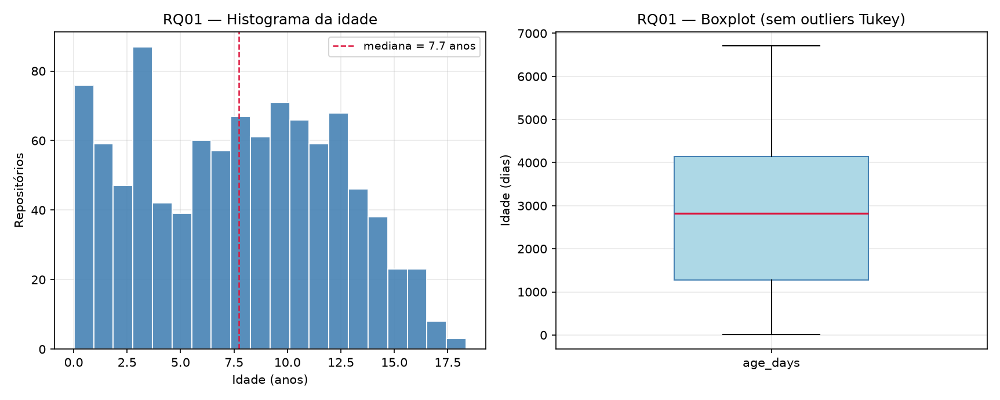
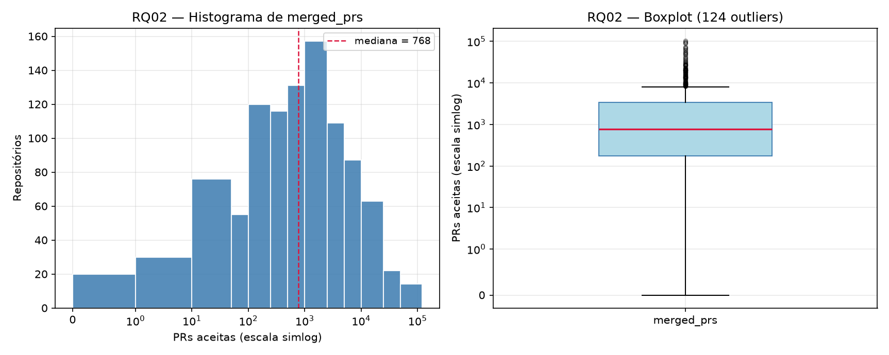
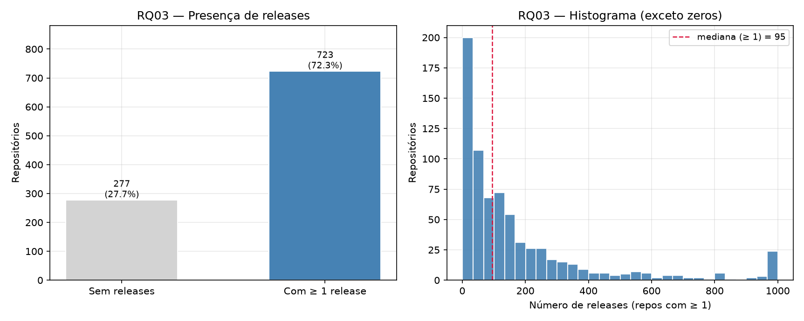

# Análise S03 — RQ01, RQ02 e RQ03

**Issue:** #35  
**Sprint:** Lab01S03  
**Dataset:** `data/repositories_top1000.csv` (1000 repositórios)  
**Script:** `src/analysis/analyze_s03_rq01_rq03.py`  
**Hipóteses:** Issues [#23](https://github.com/CaioVKodato/lab-experimentacao-software/issues/23) (RQ01, RQ02) e [#25](https://github.com/CaioVKodato/lab-experimentacao-software/issues/25) (RQ03)  
**Validações S02:** [#20](https://github.com/CaioVKodato/lab-experimentacao-software/issues/20), [#22](https://github.com/CaioVKodato/lab-experimentacao-software/issues/22)

## Metodologia

- Métricas: `age_days` (RQ01), `merged_prs` (RQ02), `releases` (RQ03).
- Estatística descritiva: N, mínimo, Q1, mediana, Q3, máximo.
- Outliers: critério de Tukey (1,5 × IQR), o mesmo da validação S02.
- Visualização: histograma e boxplot (RQ01, RQ02); barras de presença + histograma (RQ03).
- Idade em anos usa 365,25 dias (ano médio).

Para reproduzir:

```bash
python -m src.analysis.analyze_s03_rq01_rq03
```

## Resumo numérico

| RQ | Métrica | N | Mínimo | Q1 | Mediana | Q3 | Máximo | Outliers |
|---|---|---:|---:|---:|---:|---:|---:|---:|
| 01 | `age_days` | 1000 | 7 | 1267 | 2826 | 4147 | 6705 | 0 |
| 02 | `merged_prs` | 1000 | 0 | 175 | 768 | 3415 | 103403 | 124 |
| 03 | `releases` | 1000 | 0 | 0 | 40 | 149 | 1000 | 93 |

Nenhum campo usado nesta fatia está vazio no CSV.

---

## RQ01 — Sistemas populares são maduros/antigos?

**Hipótese informal (#23):** sim — popularidade exige tempo de exposição; mediana esperada na casa de vários anos.

**Métrica:** dias desde `createdAt` (`age_days`).

### Resultado

| Estatística | Valor |
|---|---|
| N válido | 1000 |
| Mediana | **2826 dias (~7.7 anos)** |
| Q1–Q3 | 1267–4147 dias (~3.5–11.4 anos) |
| Amplitude | 7–6705 dias (~0.02–18.4 anos) |
| Outliers Tukey | **0** (cerca inferior negativa; nenhum ponto cai fora) |

Faixa etária:

| Faixa | Repositórios | Percentual |
|---|---:|---:|
| < 1 ano | 82 | 8.2% |
| 1–3 anos | 109 | 10.9% |
| 3–5 anos | 133 | 13.3% |
| 5–8 anos | 192 | 19.2% |
| 8–12 anos | 277 | 27.7% |
| ≥ 12 anos | 207 | 20.7% |

Exemplos: o mais novo é `deepseek-ai/deepseek-harness` (7 dias, 173986 stars); o mais antigo é `rails/rails` (6705 dias, criado em 2008-04-11).

### Hipótese vs. resultado

**Confirmada.** A mediana de ~7.7 anos e o fato de 676 repositórios (67.6%) terem 5 anos ou mais sustentam a leitura de maturidade como traço típico da amostra.

Há um matiz: 82 repositórios (8.2%) têm menos de 1 ano — viralidade recente (IA, listas, tutoriais) consegue popularidade sem maturidade. O critério de Tukey **não** marca esses casos como outliers porque Q1 já é baixo o bastante para a cerca inferior ficar negativa. A hipótese vale para o **centro** da distribuição, não para todos os 1000.



---

## RQ02 — Sistemas populares recebem muita contribuição externa?

**Hipótese informal (#23):** sim — popularidade atrai colaboradores; volume alto de PRs aceitas.

**Métrica:** `pullRequests(states: MERGED).totalCount` no GitHub (`merged_prs`).

### Resultado

| Estatística | Valor |
|---|---|
| N válido | 1000 |
| Mediana | **768** PRs aceitas |
| Q1–Q3 | 175–3415 |
| Máximo | 103403 (`firstcontributions/first-contributions`) |
| Sem nenhuma PR merged | **20** (2.0%) |
| Outliers Tukey (>8275) | **124** (12.4%) |

A cauda é pesada: o máximo é mais de 100× a mediana. `firstcontributions/first-contributions` infla o topo porque o próprio propósito do repositório é receber o “primeiro PR” de iniciantes — contribuição real, mas não o mesmo fenômeno de um kernel ou um framework.

No outro extremo, 20 repositórios têm **zero** PRs merged no GitHub. Exemplos conhecidos da amostra: listas `awesome-*`, `torvalds/linux` (fluxo por e-mail, não pelo GitHub) e projetos que não usam pull request da plataforma. A métrica mede **contribuição via GitHub PR**, não contribuição externa em geral.

### Hipótese vs. resultado

**Confirmada para o projeto popular típico**, com ressalvas de métrica. Mediana 768 e Q3 3415 são volumes altos; 75% da amostra tem pelo menos 175 PRs aceitas. A hipótese não deve ser lida como “todo repositório estrelado tem PR no GitHub”: 2.0% não usa esse canal, e a cauda (124 outliers) mistura projetos gigantes com repositórios-tutorial.



---

## RQ03 — Sistemas populares lançam releases com frequência?

**Hipótese informal (#25):** confirmação **parcial** — releases são comuns em parte da amostra, não universais.

**Métrica:** `releases.totalCount` (`releases`).

### Resultado

| Estatística | Valor |
|---|---|
| N válido | 1000 |
| Mediana (incluindo zeros) | **40** |
| Mediana só com ≥ 1 release | 95 |
| Q1–Q3 | 0–149 |
| Máximo | 1000 (`langchain-ai/langchain` e outros) |
| Sem nenhuma release | **277** (27.7%) |
| Com ≥ 1 release | **723** (72.3%) |
| Outliers Tukey (>372.50) | **93** |
| Valor exatamente 1000 | 23 repositórios |

Q1 = 0: pelo menos um quarto da amostra nunca publicou release no GitHub. Os zeros concentram listas, livros e guias (`sindresorhus/awesome`, `public-apis/public-apis`, `EbookFoundation/free-programming-books`) e software que versiona fora da aba Releases (ex.: `freeCodeCamp/freeCodeCamp`).

23 repositórios caem exatamente em 1000 releases (ex.: `langchain-ai/langchain`). É um teto redondo na cauda — útil tratar o máximo como “≥ 1000” na discussão, não como contagem precisa.

### Hipótese vs. resultado

**Confirmação parcial, alinhada à #25.** Frequência alta de releases **não** é regra da popularidade: 27.7% não usa Releases, a mediana geral é só 40 e a média visual é puxada por uma cauda de projetos com ciclo de versão intenso (frameworks, runtimes, ferramentas). Releases frequentes descrevem os populares **mais estruturados como produto**, não a amostra inteira.



---

## Síntese

| RQ | Hipótese | Resultado nesta amostra |
|---|---|---|
| 01 | Maduros/antigos | **Confirmada** (mediana ~7.7 anos); 82 repos < 1 ano não viram outlier Tukey |
| 02 | Muita contribuição externa | **Confirmada no típico** (mediana 768 PRs); métrica = PR do GitHub; 20 zeros e cauda pesada |
| 03 | Releases com frequência | **Parcial** (27.7% sem release; mediana 40) |

Os números batem com as validações S02 (#20, #22). Esta sprint acrescenta a leitura hipótese vs. resultado e as visualizações para o relatório final.
