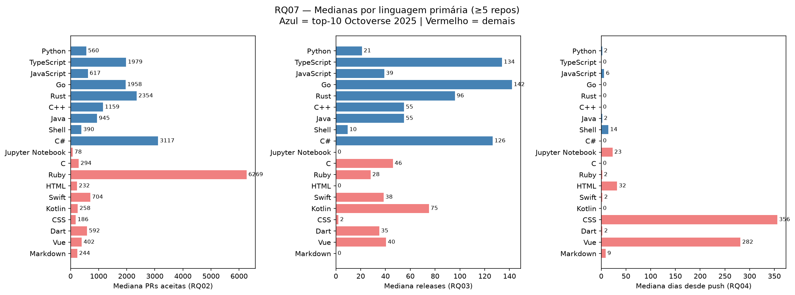

# RQ07 — Linguagens populares recebem mais PRs, releases e atualizações?

**Issue:** #34  
**Sprint:** S03  
**Script:** `src/analysis/rq07_por_linguagem.py`  
**Dados:** `data/repositories_top1000.csv` (1.000 repositórios)  
**Fonte de ranking:** GitHub Octoverse 2025  

---

## Hipótese informal

> Sim, parcialmente. Linguagens populares tendem a ter ecossistemas maiores e mais contribuidores, o que deve se refletir em mais PRs e releases. Porém, o efeito pode ser confundido pelo tipo de projeto: listas (awesome-*) e tutoriais atraem stars mas têm pouquíssimas PRs e zero releases, independentemente da linguagem.

---

## Métricas cruzadas por linguagem

| Linguagem | n | Popular? | Mediana PRs (RQ02) | Mediana Releases (RQ03) | Mediana dias push (RQ04) |
|-----------|---|----------|--------------------|-------------------------|--------------------------|
| Python | 227 | Sim | 560,0 | 21,0 | 2,0 |
| TypeScript | 173 | Sim | 1.979,0 | 134,0 | 0,0 |
| JavaScript | 111 | Sim | 617,0 | 39,0 | 6,0 |
| Go | 77 | Sim | 1.958,0 | 142,0 | 0,0 |
| Rust | 58 | Sim | 2.353,5 | 96,0 | 0,0 |
| C++ | 41 | Sim | 1.159,0 | 55,0 | 0,0 |
| Java | 41 | Sim | 945,0 | 55,0 | 2,0 |
| Shell | 20 | Sim | 389,5 | 9,5 | 14,5 |
| C# | 8 | Sim | 3.117,0 | 126,5 | 0,0 |
| PHP | 4 | Sim | 10.652,0 | 577,5 | 0,0 |
| **(sem linguagem)** | 87 | Não | 129,0 | 0,0 | 178,0 |
| Jupyter Notebook | 24 | Não | 78,0 | 0,0 | 23,0 |
| C | 21 | Não | 294,0 | 46,0 | 0,0 |
| Ruby | 13 | Não | 6.269,0 | 28,0 | 2,0 |
| HTML | 11 | Não | 232,0 | 0,0 | 32,0 |
| Swift | 10 | Não | 704,0 | 38,5 | 2,5 |

*(demais linguagens com <5 repos omitidas da tabela; incluídas no resumo)*

---

## Resumo: populares vs. demais

| Grupo | n | Mediana PRs | Mediana Releases | Mediana dias push |
|-------|---|-------------|------------------|-------------------|
| **Populares (top-10 Octoverse)** | **760** | **1.075,5** | **66,5** | **0,5** |
| Não populares / sem linguagem | 240 | 290,0 | 0,0 | 19,0 |

---

## Visualização

---

## Interpretação: hipótese vs. resultado

**RQ02 — PRs aceitas:** A hipótese se **confirma**. Repositórios em linguagens populares têm mediana de PRs 3,7× maior (1.075 vs 290). TypeScript (1.979), Go (1.958) e Rust (2.353) lideram, refletindo comunidades open-source ativas e culturas de contribuição externa consolidadas. O destaque negativo é Shell (390), que mesmo sendo popular concentra scripts e dotfiles com baixo fluxo de PRs.

**RQ03 — Releases:** A hipótese se **confirma fortemente**. A mediana de releases em linguagens populares (66,5) é infinitamente maior que em não-populares (0,0 — metade dos repos fora do top-10 nunca publicou nenhuma release). TypeScript (134) e Go (142) mostram ciclos de lançamento frequentes, compatíveis com frameworks e ferramentas em uso produtivo. Listas e notebooks têm mediana 0, puxando o grupo "não popular" para baixo.

**RQ04 — Frequência de atualização:** A hipótese se **confirma**. Linguagens populares são atualizadas quase diariamente (mediana 0,5 dias desde o último push), contra 19 dias nos demais. TypeScript, Go, Rust e C++ têm mediana 0 dias — indicando atividade diária contínua. Repos sem linguagem detectável (listas, docs) chegam a 178 dias de mediana, demonstrando que muitos já estão estagnados.

**Conclusão geral:** A hipótese é **confirmada nas três métricas**. Linguagens do top-10 do Octoverse concentram os projetos com maior engajamento externo (PRs), maior cadência de entregas (releases) e manutenção mais ativa (push recente). O efeito é especialmente pronunciado em TypeScript, Go, Rust e C# — linguagens associadas a ferramentas, frameworks e runtimes de alto impacto. A exceção parcial é Shell e Python-scripts, que mesmo sendo populares hospedam muitos projetos de automação com menos contribuição externa.
