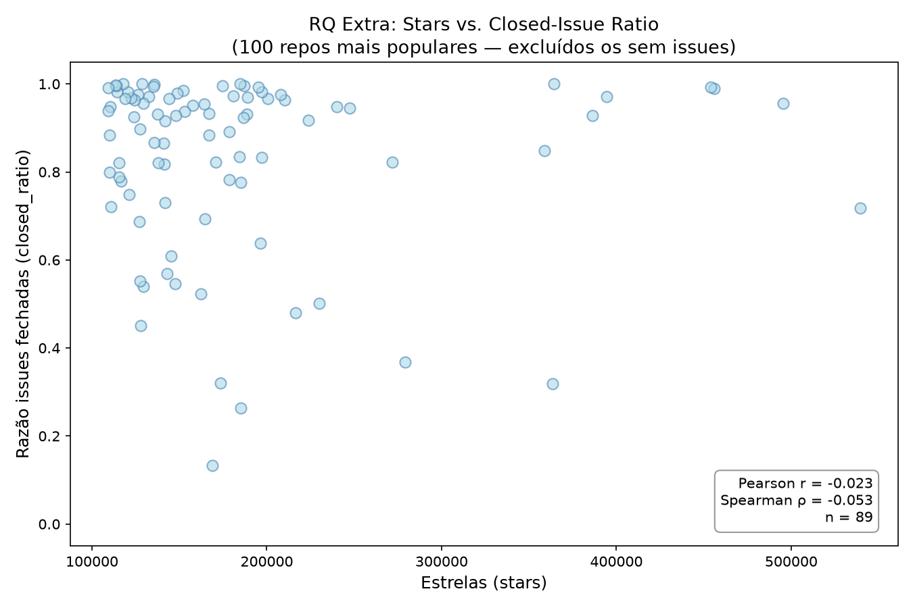

# RQ Extra: Popularidade (stars) se correlaciona com % de issues fechadas?

**Issue:** #17  
**Sprint:** S01  
**Data:** 2026-08-13  
**Script:** `src/analysis/rq_extra_stars_issues.py`  

## Hipótese informal

> Não. Repositórios enormes acumulam backlog; listas (awesome-*) têm poucas issues.  
> Stars medem visibilidade, não manutenção ativa — seria coincidência se correlacionassem com closed_ratio.

## Metodologia

- **Fonte:** `data/repositories.csv` (100 repositórios mais populares do GitHub)
- **Exclusão:** repos com `total_issues = 0` são tratados como valor ausente (sem histórico de issues rastreável — ex.: linux, gitignore, awesome-lists)
- **Métricas calculadas:** Pearson r e Spearman ρ entre `stars` e `closed_ratio`
- **Spearman** é preferido por ser robusto a outliers (stars varia várias ordens de magnitude)

## Resultados

| Métrica | Valor |
|---------|-------|
| Total de repos | 100 |
| Excluídos (`total_issues = 0`) | 11 |
| Amostra usada | **89** |
| Pearson r | **−0.023** |
| Spearman ρ | **−0.053** |
| Interpretação | Correlação praticamente nula |

### Repos excluídos (total_issues = 0)

`torvalds/linux`, `github/gitignore`, `vinta/awesome-python`, `awesome-selfhosted/awesome-selfhosted`, `996icu/996.ICU`, `trimstray/the-book-of-secret-knowledge`, `ripienaar/free-for-dev`, `justjavac/free-programming-books-zh_CN`, `Hack-with-Github/Awesome-Hacking`, `multica-ai/andrej-karpathy-skills`, `DigitalPlatDev/FreeDomain`

## Interpretação

A correlação entre stars e closed_ratio é praticamente inexistente (Spearman ρ = −0.05). A hipótese informal se confirma: **popularidade não prediz saúde do tracker de issues**.

Dois padrões opostos se anulam na amostra:
- **Repositórios de lista** (awesome-*, free-programming-books): muitas stars, pouquíssimas issues → `closed_ratio` irrelevante ou ausente.
- **Projetos ativos grandes** (freeCodeCamp, flutter, vscode): muitas stars e também alto `closed_ratio` por terem equipes dedicadas a fechar issues.

O resultado reforça que stars medem **visibilidade/alcance**, não maturidade de processo. Para estudar saúde de issues, métricas como tempo médio de resolução ou taxa de reabertura seriam mais informativas.

## Gráfico

*(gerado automaticamente por `src/analysis/rq_extra_stars_issues.py`)*
