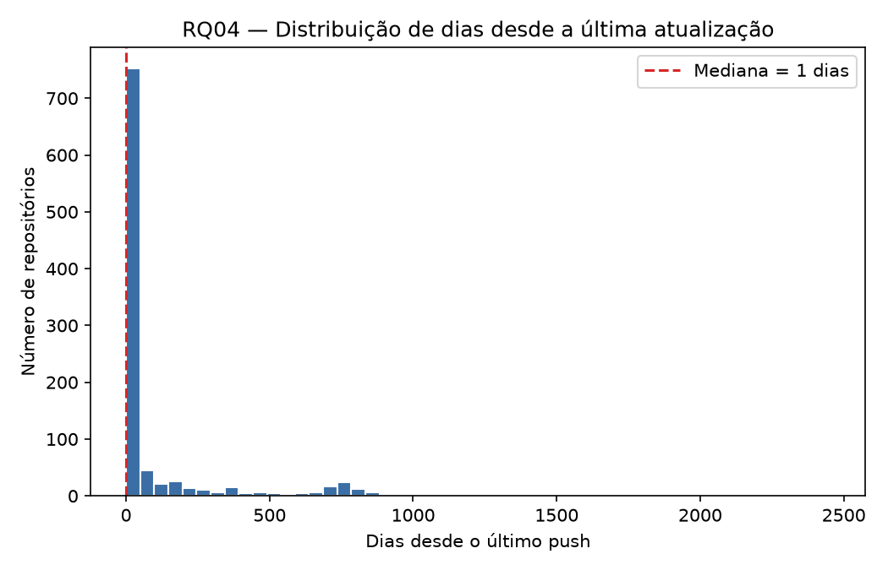
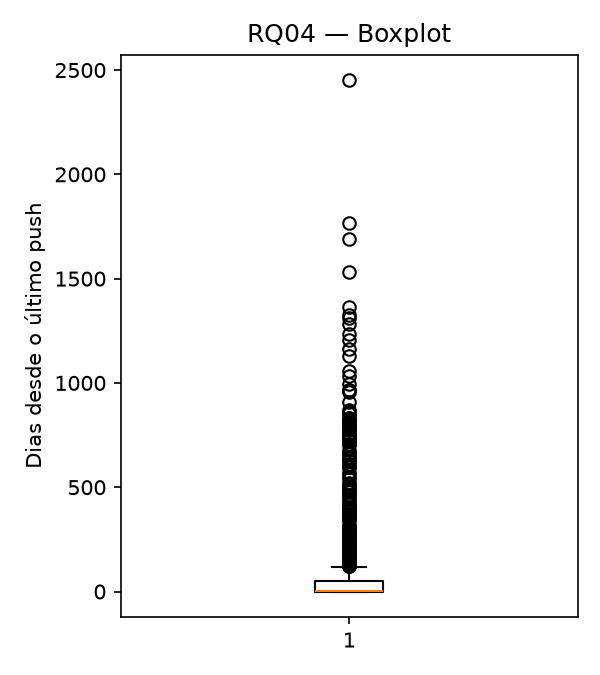
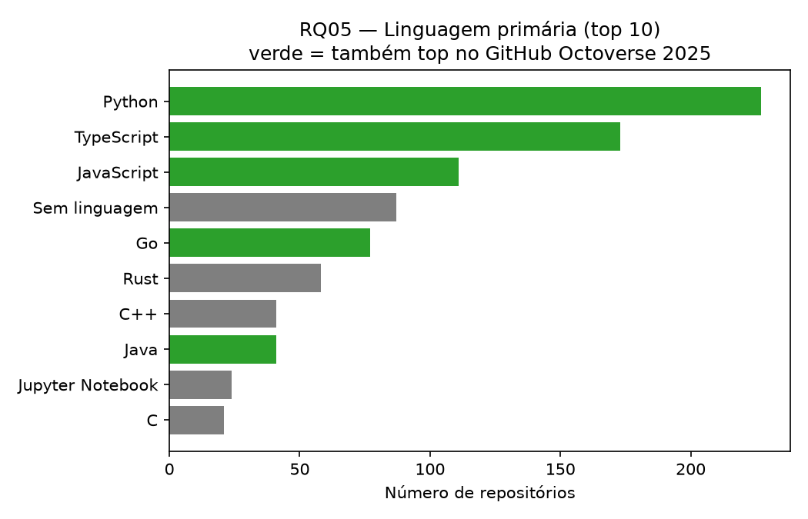
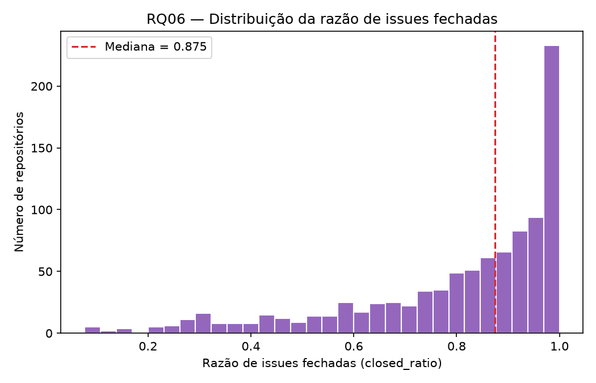

# Análise S03 — RQ04, RQ05 e RQ06

Issue: #33
Dataset: `data/repositories_top1000.csv`
Hipóteses de referência: #24 (RQ04, RQ05), #25 (RQ03, RQ06, nota RQ07)

## RQ04 — Tempo até a última atualização

| N válido | Mínimo | Mediana | Máximo | Q1 | Q3 |
|---:|---:|---:|---:|---:|---:|
| 1000 | 0 | 1 | 2452 | 0 | 48 |

**Leitura vs. hipótese informal (#24):** a hipótese de que sistemas populares são atualizados com frequência se confirma — mediana de 1 dia(s) desde o último push, com 75% da amostra (Q3) recebendo commit em até 48 dias. A distribuição no gráfico é fortemente concentrada perto de zero, com uma cauda longa de poucos repositórios sem atividade recente.

## RQ05 — Linguagem primária

Top 10 linguagens na amostra:

- Python: 22.7%
- TypeScript: 17.3%
- JavaScript: 11.1%
- Sem linguagem: 8.7%
- Go: 7.7%
- Rust: 5.8%
- C++: 4.1%
- Java: 4.1%
- Jupyter Notebook: 2.4%
- C: 2.1%

**Leitura vs. hipótese informal (#24):** confirma a hipótese — Python, TypeScript e JavaScript concentram a maior parte da amostra e aparecem entre as linguagens mais citadas no GitHub Octoverse 2025 (referência adotada no laboratório desde a S02).

## RQ06 — Razão de issues fechadas / total

Repositórios excluídos por não terem nenhuma issue (`total_issues = 0`): 43

| N válido | Mínimo | Mediana | Máximo | Q1 | Q3 |
|---:|---:|---:|---:|---:|---:|
| 957 | 0.0769 | 0.8750 | 1.0000 | 0.7042 | 0.9681 |

**Leitura vs. hipótese informal (#25):** confirma a hipótese de alta taxa de resolução de issues — mediana de 87.5% de issues fechadas, com Q1 já em 70.4%.

